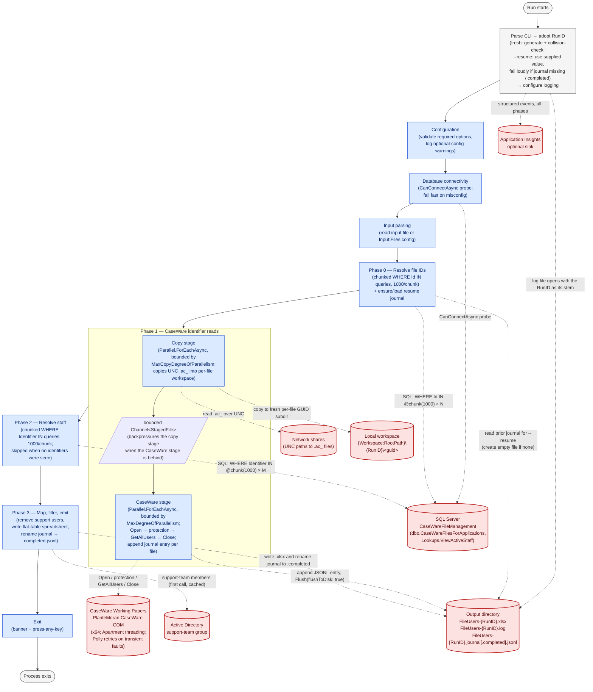

# Workflow

The diagram below traces a single run end-to-end. Every processing phase is inside the process;
every boundary the run crosses (SQL Server, network shares, the local workspace, CaseWare Working
Papers via COM, Active Directory, the output directory, optional Application Insights) is drawn as
an external node. Dashed edges are boundary crossings; solid edges are control flow inside the
process.

## Guarantees this picture enforces

- **Bounded SQL work per run.** Phase 0 issues one query per 1,000 input file IDs; Phase 2 issues
  one query per 1,000 unique identifiers seen. Both are chunked so batches of any size stay clear
  of SQL Server's 2,100-parameter cap and produce plan-cacheable query text. No queries at all in
  the parallel Phase 1 — the pipeline reads only from the network share and CaseWare.
- **At most one Active Directory query per run.** The support-team membership is loaded lazily on
  the first call from Phase 3 and cached as a case-insensitive `HashSet<string>` in the singleton
  `SupportUserFilter`, so per-file support-user removal is O(1) per staff member.
- **Phase 1 is a two-stage producer/consumer** with independent concurrency knobs.
  `Processing:MaxCopyDegreeOfParallelism` bounds how many `.ac_` copies run against the UNC share
  concurrently; `Processing:MaxDegreeOfParallelism` bounds how many CaseWare sessions are open at
  once. A bounded `Channel<StagedFile>` between them applies backpressure so the copy stage never
  runs arbitrarily far ahead. Set the CaseWare knob to `1` to serialize COM access if concurrent
  sessions misbehave on a particular host.
- **Every artifact of a single run shares its RunID stem.** `FileUsers-{RunID}.xlsx`,
  `FileUsers-{RunID}.log`, `FileUsers-{RunID}.journal.jsonl` (renamed to `.journal.completed.jsonl`
  on success) all sit next to each other in the output directory. The workspace root uses the same
  RunID as its subdirectory name, so orphaned workspaces from a crashed run can be traced back to
  the log file and journal.
- **Memory is bounded by what the input actually references** — the file IDs in the batch, the
  identifiers seen across all files, and the support-team's members. Never the full size of the
  underlying tables.
- **Per-file isolation.** Each Phase 1 CaseWare worker gets a fresh DI scope and processes its
  file from a fresh per-file GUID subdirectory under the workspace root, so each CaseWare session
  is isolated from every other in-flight session.
- **Journaled progress is durable across crashes.** Each file's Phase 1 outcome (identifiers or
  per-file error) is appended to `FileUsers-{RunID}.journal.jsonl` with `Flush(flushToDisk: true)`
  before the workspace is torn down, so a subsequent `--resume {RunID}` picks up right where the
  abort landed. Files already in the journal skip Phase 1 entirely on resume.

## What happens on failure

- **A per-file failure** (CaseWare open, FILE-group read, file-ID not found in the database,
  workspace copy IOException, etc.) is recorded as that file's error and Phase 1 continues with
  the remaining files. The file still produces one or more rows in the spreadsheet (Share / File /
  Errors) and a corresponding journal entry.
- **A per-user failure** (a CaseWare identifier with no matching staff record) is recorded as a
  user-level error on that file and the remaining users on the file are still emitted.
- **AD failure or missing configuration** is logged once at first use; the cached membership
  becomes empty and no users are removed for the rest of the run.
- **`Ctrl+C` (first press)** begins a graceful shutdown: an immediate warning is logged so the
  user knows the keypress was received, then the cancellation token is set. In-flight files finish
  or throw, the journal preserves whatever completed, no spreadsheet is written, and the process
  exits with code `2`.
- **`Ctrl+C` (second press)** aborts immediately via `Process.Kill()` (TerminateProcess) — the
  escape hatch when a graceful shutdown is stuck on a native CaseWare COM call the CLR cannot
  interrupt. The journal on disk still holds every file whose Phase 1 `finally` block already
  fired.
- **`--resume {RunID}`** picks up where a prior crashed run left off. Files in the journal skip
  Phase 1 entirely; the retry policy for previously-errored entries is controlled by
  `Processing:RetryErroredFilesOnResume`. `--resume` fails loudly if the journal for the supplied
  RunID is missing or already marked completed.
- **Missing required configuration** at start-up (`ConnectionStrings:CaseWareFileManagement`,
  `CaseWare:LoginUserId`, `CaseWare:LoginUserPassword`, etc.) fails the run before any external
  boundary is crossed, with a clear message and exit code `-1`.
- **Database unreachable at start-up** is detected by the connectivity probe before Phase 1 begins
  — no CaseWare reads are wasted. The failure is logged with the underlying SQL error message and
  a hint about `TrustServerCertificate=True` for on-prem servers; exit code `-1`.
- **A locked file blocks workspace cleanup** (a PDF that antivirus, indexer, or a viewer is
  holding) is retried by Polly with exponential backoff. If the lock persists past the retries, a
  single warning is logged naming the workspace and the underlying reason — no stack trace — and
  the run continues. The leftover directory can be removed manually.
