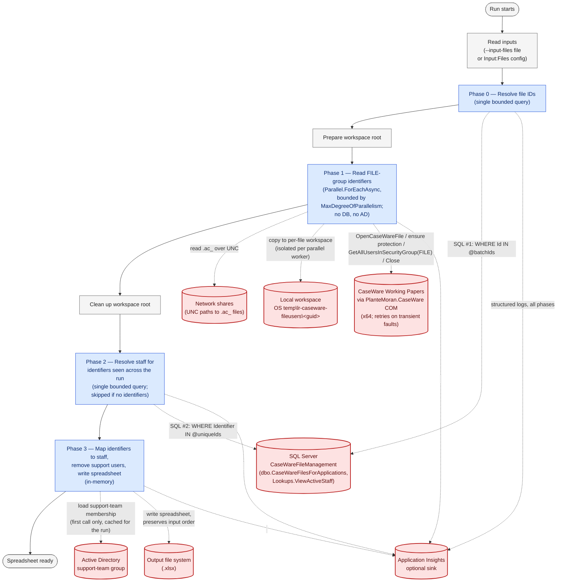

# Workflow

The diagram below traces a single run end-to-end. The four phases are inside the process; every
boundary the run crosses (SQL Server, network shares, the local workspace, CaseWare Working Papers
via COM, Active Directory, the output file, optional Application Insights) is drawn as an external
node. Dashed edges are boundary crossings; solid edges are control flow inside the process.

## Guarantees this picture enforces

- **At most two SQL queries per run.** Phase 0 hits the database once; Phase 2 hits it once (and is
  skipped if no identifiers were seen). Nothing in the parallel phase touches the database.
- **At most one Active Directory query per run.** The support-team membership is loaded lazily on the
  first call from Phase 3 and cached in the singleton `SupportUserFilter` for the lifetime of the
  process.
- **CaseWare concurrency is exactly bounded by `Processing:MaxDegreeOfParallelism`.** Phase 1 is the
  only place a CaseWare session is opened; the parallel cap is enforced by `Parallel.ForEachAsync`,
  not by chance. Set it to `1` to serialize CaseWare access if concurrent COM sessions misbehave on a
  particular host.
- **Memory is bounded by what the input actually references** — the file IDs in the batch, the
  identifiers seen across all files, and the support-team's members. Never the full size of the
  underlying tables.
- **Per-file isolation.** Each Phase 1 worker copies its `.ac_` into a fresh per-file workspace
  directory (`Path.Combine(workspaceRoot, Guid.NewGuid())`) and gets a fresh dependency-injection
  scope, so each CaseWare session is isolated from every other in-flight session.

## What happens on failure

- **A per-file failure** (CaseWare open, FILE-group read, file-ID not found in the database, etc.)
  is recorded as that file's error and Phase 1 continues with the remaining files. The file still
  produces a row in the spreadsheet with its errors and no users.
- **A per-user failure** (a CaseWare identifier with no matching staff record) is recorded as a
  user-level error on that file and the remaining users on the file are still emitted.
- **AD failure or missing configuration** is logged once at first use; the cached membership becomes
  empty and no users are removed for the rest of the run.
- **`Ctrl+C`** cancels the run cleanly: the workspace root is still torn down, no spreadsheet is
  produced, and the process exits with code `2`.
- **Missing required configuration** at start-up (`ConnectionStrings:CaseWareFileManagement`,
  `CaseWare:LoginUserId`, `CaseWare:LoginUserPassword`, etc.) fails the run before any external
  boundary is crossed, with a clear message and exit code `-1`.
- **Database unreachable at start-up** is detected by a connectivity probe before Phase 1 begins —
  no CaseWare reads are wasted. The failure is logged with the underlying SQL error message and a
  hint about `TrustServerCertificate=True` for on-prem servers; exit code `-1`.
- **A locked file blocks workspace cleanup** (a PDF that antivirus, indexer, or a viewer is holding)
  is retried by Polly with exponential backoff. If the lock persists past the retries, a single
  warning is logged naming the workspace and the underlying reason — no stack trace — and the run
  continues. The leftover directory can be removed manually.
